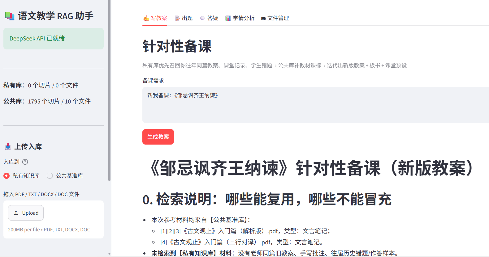

# 语文教学 RAG 助手

一个帮你备课、出题、答疑、看学情的 AI 小助手。你把资料拖进去，它替你记住、替你整理，等你用的时候再吐出来。


## 教育的灵魂是什么？

同样一篇《道德经》，文本千年不变，但每个学生的阅历、困惑、思维底色不同，读到的就完全不同：有人停在字面释义，有人读出处世心态，善思辨的学生会追问逻辑、辨析矛盾。不是经文有多个答案，而是学习者带着自己的经验去对话，收获千人千面。

**这个助手，就是帮你把这些课堂上的多元解读、碰撞与奇思妙想，沉淀下来，变成一个会回答问题的第二大脑。**

把手里的东西分成两类：

 **私有库（private）**：你的教案、课堂记录、学生错题、你手写的批注、以及各种学生的奇思妙想
 **公共库（public）**：教材、真题、参考书、文言选本
一开始测试的是《古文观止》、《世说新语》、《史记》、《资治通鉴》、《道德经》、《论语》和《诸子精神》

要用的时候，它先从私有库翻（因为最懂你学生的，是你自己），不够了再用公共库补。所以它给你的答案，是你的答案，不是网上随便抄的。


## 它跟普通的 AI 问答有什么不一样？

无论 GPT、DeepSeek 还是豆包，直接问它们，给的答案都是极其详尽的大路货，而且很容易出现幻觉。

什么叫幻觉？就是模型不知道答案的时候，不说"我不知道"，而是一本正经地编一个。它倒不是故意撒谎，而是大模型的工作方式决定的——它本质是在"预测下一个最像样的词"，所以哪怕没有依据，也能拼出一段读起来很专业的话。

这个助手虽然也是调用 DeepSeek，但相当于让大模型开卷考试：模型还是那个模型，只是答题时手里多了一本随时能更新、而且属于你自己的参考书。

RAG 的关键动作，就是"检索出最相关的几段资料，拼进上下文"，而不是把整个知识库一股脑塞进去。这个系统很多功夫，都花在"怎么让塞进上下文的那几段，又准又全"。

具体为语文教学做了这么几件事：

 **切资料不搞一刀切**：教案按课时切，错题按一道题切，文言笔记按一个字（实词 / 虚词）切，作文按立意切。切得准，才找得准。
 **资料进去前先贴标签**：学段、单元、篇目、知识点、类型、学情，六样都标好，找起来才不瞎。
 **你有两本账**：公共库 + 私有库，私有库优先，你手写的批注永远排第一。
 **每个结果都标着 `[1][2]…`**，能点回去看是出自哪个文件、哪个库，不怕它瞎编。


## 四个场景，完成闭环

1. **✍️ 写教案**   把你以前备同一篇的教案、学生常错的地方捞出来，帮你改出一份新教案，风格还是你的。
2. **📝 出题**  学生哪儿薄弱、选择题干扰项，都从你库里的真实错题里来，反复刷强化记忆。
3. **💬 答疑**   用你课堂上讲过的例子、话术去引导，而不是直接甩答案。
4. **📊 学情分析**   把这一课学生的错题归总，告诉你高频错误、易混淆点、该怎么补。

闭环的动作在第 4 步又接回第 1 步：新暴露的错题会自动存回库里，下次备课、出题又被翻出来。用着用着，你的教学经验就一点点攒下来了，越用越懂你的班。
不光是错题——你每次生成的教案、试卷、学情报告，也会自动存回私有库，下次再备同一篇时，会优先参考你上一次的产出。


## 怎么安装？

### 1. 装 Python

去 [python.org](https://www.python.org) 下一个装上（版本 3.10 以上就行），一路「下一步」。

### 2. 装依赖

打开命令行（Windows 按 `Win+R`，输入 `cmd` 回车），进到项目文件夹：

```bash
cd rag-teacher
python -m venv .venv
.venv\Scripts\activate
pip install -r requirements.txt
```

> 苹果电脑或 Linux 的话，第三行换成 `source .venv/bin/activate`。

### 3. 填 API key

去 DeepSeek 官网 <https://platform.deepseek.com> 注册账号，创建一个 API key。

把 .env.example 复制一份，改名叫.env，然后把 DEEPSEEK_API_KEY= 后面换成你的真实 key（不加引号）：

```
DEEPSEEK_API_KEY=sk-xxxxxxxx
```

然后就可以开始烧 token 了（放心，DeepSeek 很便宜，冲个100块够一个月，梁圣NB！！）。
或者会搭VPN的可以尝试GPT - 6，出点血借用一下神的力量。

### 4. 启动

```bash
streamlit run app/streamlit_app.py
```

> 要是提示 `streamlit` 找不到，就换成 `python -m streamlit run app/streamlit_app.py`。

浏览器会自动打开一个网页。往 `ingest/private` 或 `ingest/public` 文件夹里拖文件，或者用网页左侧的上传框，就完事了。


## 怎么用？

打开后长这样：



### 先确认资料放哪

**你私人的东西进私有库，通用的进公共库。**

你的教案、课堂笔记、课件、板书    `ingest/private`（私有库）   
学生错题、作答样本、作文    `ingest/private`   
教材、真题、参考书、文言选本    `ingest/public`（公共库）   
优质课案例、课标、教参    `ingest/public`   

> 出题和学情分析**只认私有库**，所以你的教案、错题放得越多，这两样就越厉害。

### 资料怎么进去？三种方式

1. **网页上传**：左侧选「私有库」还是「公共库」，拖文件进上传框。
2. **拖进文件夹**：直接把文件扔进 `ingest/private` 或 `ingest/public`，它会自动发现并入库。
3. **手动扫描**：网页左侧点「🔍 扫描现有文件」。

支持格式：PDF / TXT / DOCX / DOC（一般够用了）。

### 四个场景怎么用

网页顶部有四个 Tab，点进去就正常和大模型对话就行
   
每个结果下面都有个引用来源折叠面板，展开能看到它参考了哪些文件、来自私有库还是公共库。


## 常见问题
   
`streamlit` 命令找不到    换成 `python -m streamlit run app/streamlit_app.py`   
提示 `No module named xxx`    依赖没装全，再跑一次 `pip install -r requirements.txt`   
第一次用很慢（约 1 分钟）不要担心，正常，模型在预热，等这一次，之后秒开   
下载模型特别慢 耐性等待，`.env` 里已经配了国内镜像，一般没事   
终端里中文乱码，命令前面加 `PYTHONUTF8=1`   
`.doc` 文件读不出来 ， 可能是老版 Word 文档，本机得装了 Word 或 WPS   
某些 PDF 被跳过了 ，因为是扫描件，没有文字层，得先 OCR 或换有文字的 PDF   
出题/学情提示「无相关内容」因为私有库还是空的，先把教案、错题放进去   
再有其他问题发我瞅瞅

## tips

你的 API key 只存在 `.env` 里，千万不能外传！！！！！！！！！！！！1
所有资料、向量库都在你自己电脑上，不上传任何第三方。
如果只用公共库的资料，那就和在网页版跟 DeepSeek 聊天没区别了，你教学过程中沉淀下来、可以复用的方法，以及学生的奇思妙想，才是灵魂。
建议非技术背景同学学学Git怎么用，可以把有价值的东西push上去、
